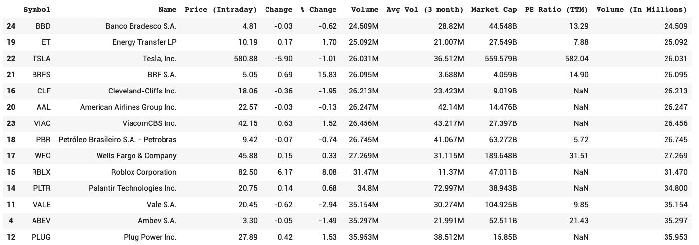

# CodeSpec

[Projects](https://google.com) | [Resume](resume.md) | [About Me](about.md)

## Latest Projects.

### [TerraComp Stock Analysis](https://colab.research.google.com/gist/wolejnr/773315a56e6b3cb8cbfdd1f3193eebc3/test2.ipynb)
This project was executed on behalf of TerraComp Inc. The goal was to analyzed the stock market data presented by Yahoo Finance
so as to determine viable stocks to be purchased.
* **Python** - was the language used in the project
* **Requests** - is a Python library used to scrape the Yahoo Finance site
* **Pandas** - was the Python library used to store and manipulate the data retrieved from Yahoo Finance

